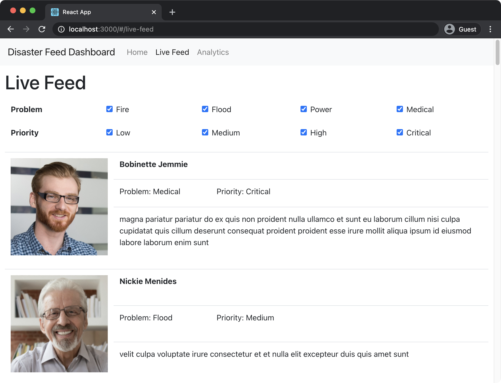
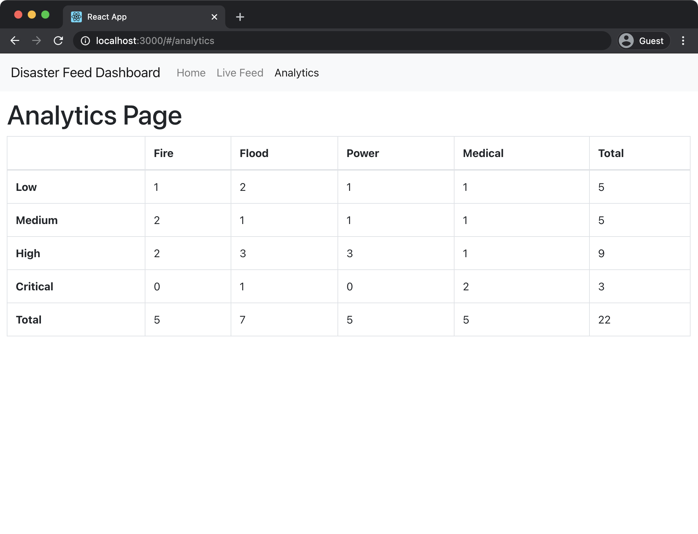

# Disaster Feed Dashboard

Assignment 4 for SFWRENG 4HC3 - Human Computer Interfaces

## Overview

The goal of this assignment was to create a dashboard for an incoming stream of posts. These posts would contain content, a picture, a problem type (fire, flood, power, and medical), and a priority level (low, medium, high, and critical). The dashboard (front-end) features a Home page, a Live Feed page, and an Analytics page.

The Live Feed page takes the incoming posts, formats them into a "card" and pushes it to the screen. The Live Feed can also be filtered to only display posts of a specified problem types and priority levels.

    

The Analytics page contains a table displaying the number of posts under a give problem/priority. Columns contain the problem types, and the rows contain the priority levels. This table also includes totals for each row or column.

    

> The server was provided by Dr. Kevin Browne. The front-end was built by me.

## How To Run

Both the front-end and the server need to be running at the same time.

### Front-End

1. Go into the `frontend` folder
2. `npm install`
3. `npm start`

### Server

1. Go into the `server` folder
2. `npm install`
3. `npm start`

## Technologies Used

- React
- Web Sockets
